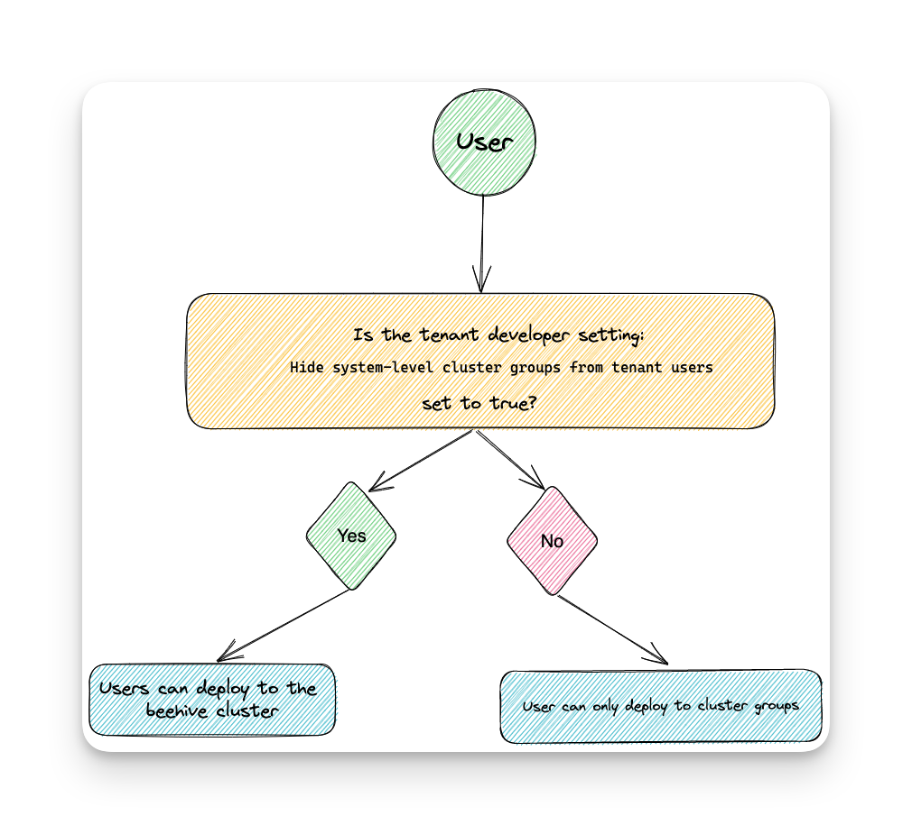
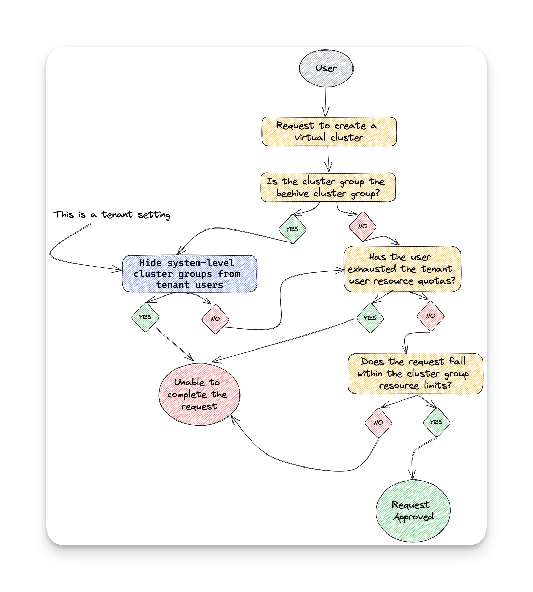

import Tabs from 'shared/components/ui/Tabs';
import InfoBox from 'shared/components/InfoBox';
import WarningBox from 'shared/components/WarningBox';
import PointsOfInterest from 'shared/components/common/PointOfInterest';
import Tooltip from "shared/components/ui/Tooltip";


# Overview

This section covers the available deployment environments for Palette Virtual Clusters and the resource quotas users and virtual clusters are subject to.

# Available Environments

Users of Palette Dev Engine by default have access to a Palette managed cluster group titled *beehive*. The beehive cluster group falls under the free tier of Palette and comes with its own set of limits. All users are subject to the following resource quotas when using the beehive cluster group.

| Type            | Max Limit | Description                                                                                           |
|-----------------|-----------|-------------------------------------------------------------------------------------------------------|
| Virtual Cluster | 2         | Each user is allowed to deploy a total of two virtual clusters.                                       |
| CPU             | 12        | Each user is allowed to consume a total of 12 CPU. This limit spans both virtual clusters.           |
| Memory          | 12 Gib    | Each user is allowed to consume a total of 12 GiB of Memory. This limit spans both virtual clusters.  |
| Storage         | 20 GiB    | Each user is allowed to consume a total of 20 GiB of storage. This limit spans both virtual clusters. |


Palette administrators can remove the beehive cluster for all downstream users by setting the tenant developer setting **Hide system-level cluster groups from tenant users** to true. If the setting's value is set to true then the beehive cluster is removed from the cluster group drop-down selection Menu when deploying Palette Virtual Clusters.



You can change the tenant developers'  settings by switching to the tenant scope and navigating to the left **Main Menu**, and selecting **Tenant Settings**. Select **Developers Settings** from the **Tenant Settings Main Menu**. Adjust the **Hide system-level cluster groups from tenant users** toggle button.


# Virtual Cluster Resource Quota

Virtual clusters inherit resource quotas from the parent cluster group. The cluster group's virtual cluster settings determine the maximum resources per virtual cluster, and can be used to limit the resources a virtual cluster can claim from the group. Each virtual cluster requires by default at least 4 CPU, 4 GiB Memory, and 2 GiB of storage. Keep the required minimum values in mind when deploying virtual clusters or when defining the cluster group's virtual cluster settings.

|**Virtual Cluster** | **Minimum Limit**|
|------------------------------|-----------------|
|CPU (per request)             |  4               |
| Memory (per request)         |  4 GiB           |
| Storage (per request)        |  2 GiB           |


<WarningBox>

A virtual cluster requires a minimum of 4 CPU, 4 GiB Memory, and 2 Gib of storage to launch successfully. The default settings in the cluster group virtual cluster configuration YAML file has the following values:

```yaml
vcluster
  resources:
    limits:
      cpu: 1000m
      memory: 1Gi
      ephemeral-storage: 1Gi
    requests:
      cpu: 200m
      memory: 256Mi
      ephemeral-storage: 128Mi
```

Increasing the limit and request values could result in a virtual cluster requiring more resources than the default values of  CPU, 4 GiB Memory, and 2 Gib of storage.

</WarningBox>

If a user attempts to create a virtual cluster that needs more resources than the cluster group allows, the request will be denied because it goes over the cluster group's defined limits.


Refer to the [Create and Manage Cluster Groups](/clusters/cluster-groups/create-cluster-group) to learn more about adjusting cluster group's virtual cluster settings.


# Users Resource Quotas

All Palette users are subject to resource quotas. The two entities that impact a user's resource quotas when interacting with virtual clusters are the tenant developer user quotas, and the cluster group virtual cluster settings. 

## Tenant User Quotas Settings

The global user quotas that a Palette administrator has defined in the tenant developer settings are always evaluated first. The tenant user quotas define the maximum set of resources a user can claim.

* Virtual clusters

* CPU

* Memory

* Storage

For example, assume the following tenant developer use quotas values are defined. Four virtual clusters, 20 CPU, 32 GiB Memory, and 60 GiB of storage. With these settings, all users could deploy four virtual clusters, each virtual cluster with a max size of 4 CPU, 8Gib Memory, and 15 GiB.

Users could also deploy a single virtual cluster that consumes 20 CPU, 32 GiB of Memory, and 60 GiB of storage. In the latter example, the user could not deploy additional clusters due to exhausting all their CPU, Memory, and storage resources.

<br />

<InfoBox>

To change tenant user quotas, switch the scope to tenant admin. Next, navigate to the left **Main Menu** and select **Tenant Settings**. Select **Developer Settings**. In the **User Quota** section, you can adjust the maximum resource values for users.


</InfoBox>

# Quota Evaluation

Before deciding if the virtual cluster creation request can be accepted, Palette evaluates each request to verify the user making the request has enough resource quotas remaining per the defined tenant user quota and if the virtual cluster request falls within the allowed limits of the parent cluster group.

The following diagram displays the evaluation process Palette uses to determine the status of a virtual cluster creation request.



To better understand this concept, use the following examples.

* Tenant Developer User Quotas:
    * Number of virtual clusters: 4 
    * CPU: 20
    * Memory: 32 GiB
    * 60 GiB


* Cluster Group *dev-special* Virtual Cluster Settings
    * CPU (per requests): 8
    * Memory (per requests): 12 GiB
    * Storage (per requests): 12 GiB


* User A' Current Resource Utilization
    * 1 Virtual Cluster in dev-special
    * 8 CPU
    * 12 GiB Memory
    * 20 GiB Memory


* User B' Current Resource Utilization
    * 4 Virtual Cluster in dev-special
    * 16 CPU
    * 32 GiB Memory
    * 60 GiB Memory


#### Scenario 1

User A is creating a request to deploy a virtual cluster to the dev-special cluster group. The virtual cluster is requesting the following resources:
* 8 CPU
* 12 GiB Memory
* 20 GiB Memory

**Request**: ✅

**Explanation**: From a tenant user quota perspective, user A has the following remaining resources - two virtual clusters, 12 CPU, 20 GiB Memory, and 40 GiB of storage. From a cluster group perspective, user A is within the resource limits of the dev-special cluster group.

<br />

#### Scenario 2

User B is creating a request to deploy a virtual cluster to the dev-special cluster group. The virtual cluster is requesting the following resources:
* 4 CPU
* 8 GiB Memory
* 4 GiB Memory

**Request**: ❌

**Explanation**: User B has exceeded the tenant user quota limits of four clusters. From a cluster group perspective, the virtual cluster request falls within the approved limits.

<br />

#### Scenario 3

User B is creating a request to deploy a virtual cluster to the beehive cluster group. The virtual cluster is requesting the following resources:
* 4 CPU
* 8 GiB Memory
* 4 GiB Memory

**Request**: ✅
 
**Explanation**: The request is accepted by the system because its targeting the beehive cluster group and not a cluster group managed by the tenant. From a cluster group perspective the resources requested fall within the allowed resource ranges allowed by the beehive cluster group.


<!-- ## Manage Developer Quota

To create your cluster groups, you must manage the developer quota in Palette by hiding the system-level cluster groups as follows:

1. Log in to [Palette](https://console.spectrocloud.com/). 

2. In **Cluster Mode**, select **Tenant Admin** from the drop-down menu 

3. Click **Tenant Settings** in the Main Menu and select **Developer Settings**. 

4. In **Manage Developer Settings**, toggle the `Hide system-level cluster groups from tenant users` option to *on*.

5. Set desired values for *User Quotas*. The table lists the default values.

|**Resource Requirement for two Palette Virtual Clusters**|**Default Quota**|**Minimum Value**|
|--------|-------------|-------------|
|CPU|12|4|
|Memory| 16 GiB|4 GiB|
|Storage| 20 GiB|2 GiB|

If limits defined for cluster groups are lower than the default quota shown in the table, the size of the respective resource (CPU, memory, or storage) will update automatically to the lower limit. You can verify cluster group limits on the **Cluster Group Settings** page. 

Palette offers a default ephemeral-storage of 1 GiB for virtual clusters launched on the Beehive cluster group.

 You can track the status of the resource quota from **Overview** in the **Main Menu** of Palette Dev Engine console.

To summarize quota allocation, each user in a tenant may create up to two virtual clusters with a cumulative CPU/memory/storage quota across all their virtual clusters. Each virtual cluster may consume up to 2.5 vCPU and 2.5 GiB memory from the allocated quota. -->

<br />

