import Tabs from 'shared/components/ui/Tabs';
import WarningBox from 'shared/components/WarningBox';
import InfoBox from 'shared/components/InfoBox';

# Palette SSO with Microsoft AD FS
Single sign-on (SSO) is an authentication method that enables users to log in to multiple applications and websites with one set of credentials. SSO works upon a trust relationship established and maintained between the service provider (SP) and an identity provider (IdP) using certificates. Spectro Cloud Palette supports SSO based on either SAML or OIDC.

This section talks about how we can enable Palette SSO with [Microsoft AD FS](https://docs.microsoft.com/en-us/windows-server/identity/ad-fs/development/ad-fs-openid-connect-oauth-concepts) based on OIDC.

<InfoBox>

  Note that you cannot use Microsoft AD FS for SAML based SSO with Palette, since Microsoft AD FS does not support the newer Canonical XML 1.1 standard that Palette employs. Hence you can only use the OIDC based approach for Microsoft AD FS.

</InfoBox>

# Prerequisites
In order to setup OIDC based SSO with Microsoft AD FS, you need to use one of the following versions:
* Microsoft AD FS 2022 (comes with Windows Server 2022)
* Microsoft AD FS 2019 (comes with Windows Server 2019)
* Microsoft AD FS 2016 (comes with Windows Server 2016)

If you need to be able to your AD FS service from outside your corporate network (this is typically the case), you will also need an AD FS Reverse Proxy. Microsoft unfortunately does not provide a tutorial on how to set this up, but you can find a good alternative [here](https://blog.matrixpost.net/set-up-active-directory-federation-services-ad-fs-5-0-adfs-reverse-proxy-part-2/)

# Enablement
## 1 - Create the AD FS Application Group for Palette

Open the AD FS Management console on your Windows Server and add a new Application Group for Palette:

Provide a suitable name for the Application Group and select **Server Application** from the list of templates. Then click **Next**:

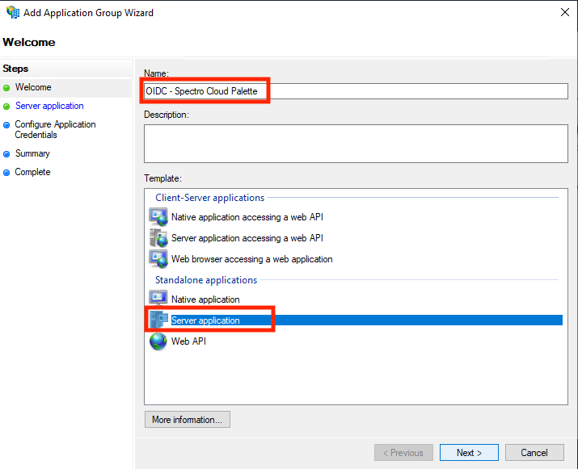

The next screen shows the **Client Identifier** for this Application Group:

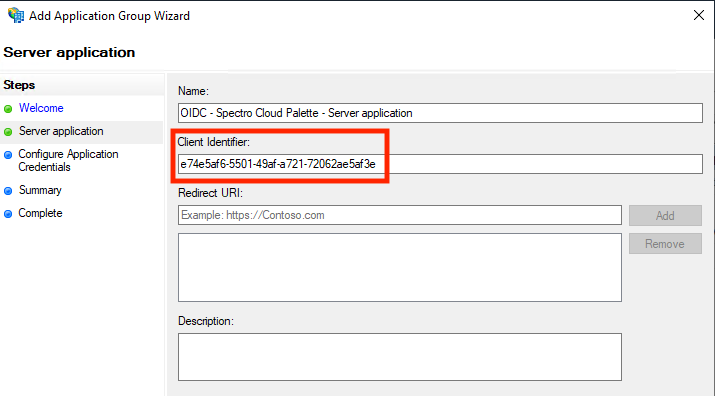

Copy this value and save it somewhere. We will need to enter this value into Palette SSO configuration later. Open a web browser and navigate to your Palette subscription. Navigate to **Tenant Settings** --> **SSO** and click **OIDC**. Click the button next to **Callback URL** to copy this value into the clipboard:

Switch back to your AD FS Management console and paste the copied value into the **Redirect URI** field, then click **Add** to add it to the list:

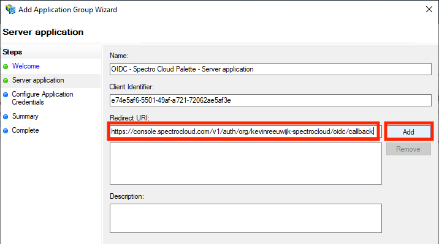

This redirect URI is all that's needed for SSO to work with Palette. However, if you also want to leverage this same AD FS server for OIDC authentication into your Kubernetes clusters at some point, you should the following additional redirect URIs to the list as well:
* `http://localhost:8000` (for using kubectl with the `kube-login` plugin from a workstation)
* `https://console.spectrocloud.com/v1/shelly` (for using the web-based kubectl console)
* `https://<fqdn-of-k8s-dashboard>/oauth/callback` (for using OIDC authentication into Kubernetes Dashboard)

When finished entering redirect URLs, click **Next**. On the next page of the wizard, select **Generate a shared secret** and click **Copy to clipboard** to copy this value and save it somewhere. We will need to enter this value into Palette SSO configuration later:

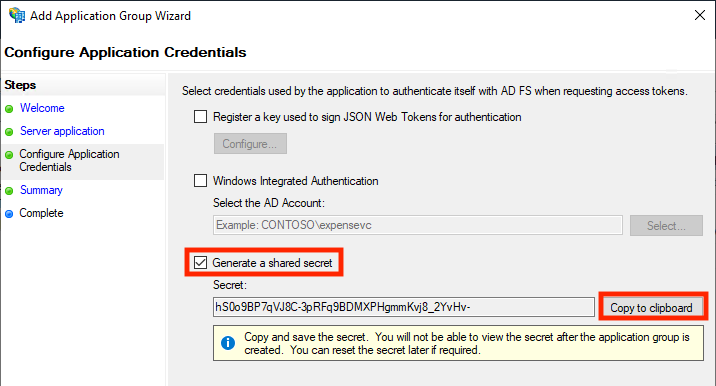

Click **Next** and on the Summary screen, click **Next** again to complete the wizard. Now we need to another application to our Application Group. Select the newly created Application Group and click **Properties**:

In the Properties screen, click **Add application...**. In the wizard that opens, select **Web API** and click **Next**:

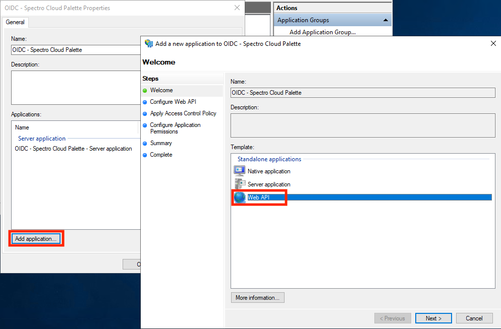

In the **Identifier** field, add the following entries one by one:
* The **Client Identifier** that we saved when creating the Application Group
* The base URL of your Palette tenant. This is equal to the URL shown by your browser when logged into Palette minus the path:

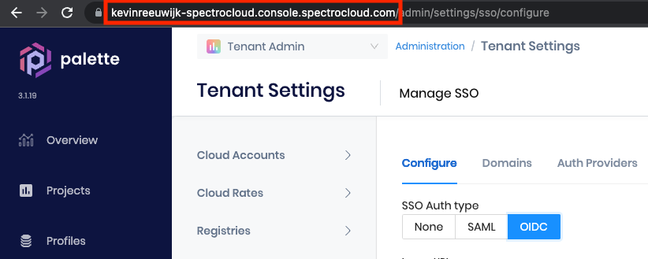

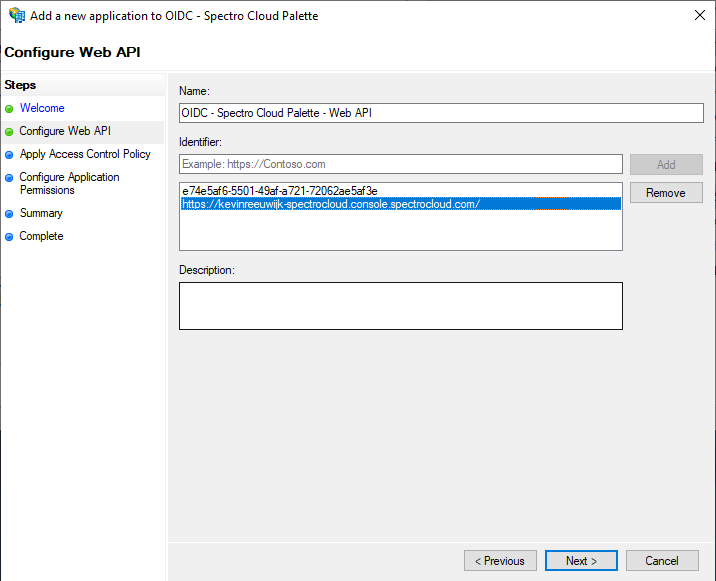

Click **Next** when done. On the next screen, select a suitable policy for who can use this SSO and under what circumstances. If you're not sure which policy to choose, select **Permit everyone**, then click **Next**:

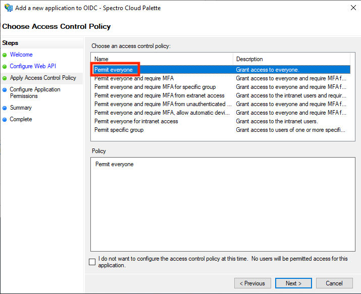

On the next screen, by default only the **openid** scope is ticked. However since we want to include the user's groups in the OIDC claim, we need also enable the **allatclaims** scope. If your AD FS server does not yet have an **allatclaims** scope in the list, click **New scope...** and type `allatclaims` in the Name field, then click OK to add it. Ensure both scopes are enabled and then click **Next**:

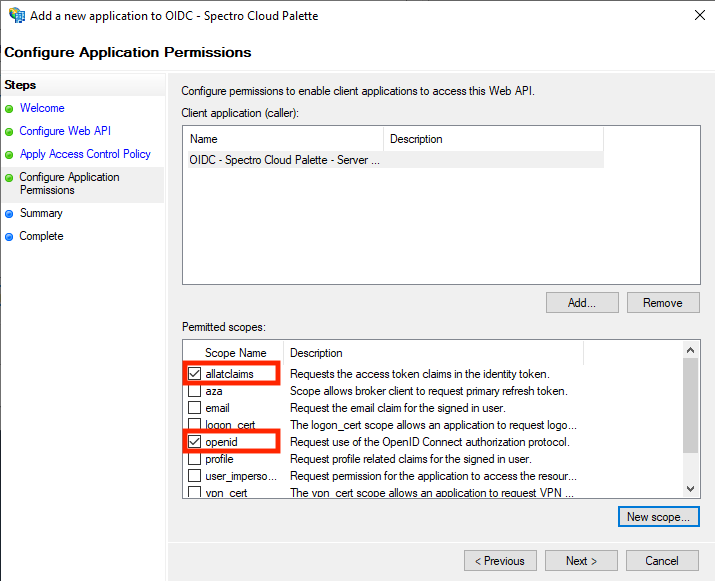

On the Summary screen, click **Next** to finish the wizard. We need to set the Issuance Transform Rules for the Web API application, so we need to open up the application again. Double-click on the Web API entry (or click the **Edit** button) to open it:

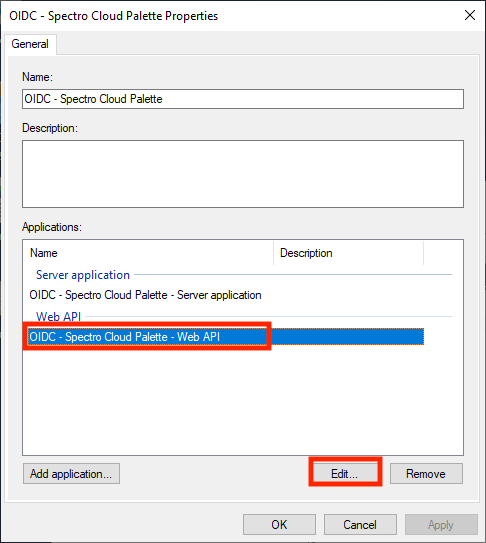

Navigate to the **Issuance Transform Rules** tab and click on **Add Rule**:

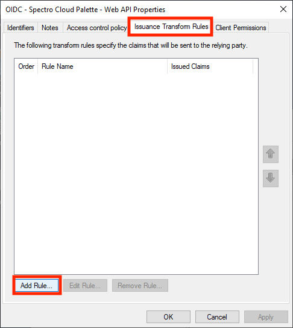

Select the **Send LDAP Attributes as Claims** template and click **Next**:

Name the rule `OpenID - LDAP Attribute Claims`. Select **Active Directory** as the Attribute store and add the following LDAP mappings:
* `E-Mail-Addresses` --> `email`
* `Given Name` --> `given_name`
* `Surname` --> `family_name`

You can select the items on the left from the list. You will need to type the items on the right manually. Ensure you use all lowercase characters for the values on the right:

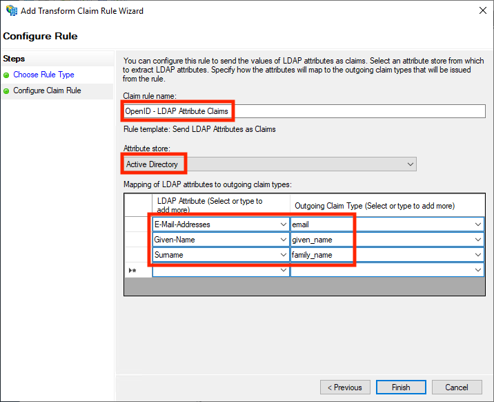

Click **Finish** to add the rule. Now click on **Add Rule...** again to add the second rule:

Select the **Send Group Membership as Claims** template and click **Next**:

In the next screen, define the group claim as desired. In this example, we have a group in Active Directory called `SpectroTeam - Admins` and we want anyone that is a member of that group, to be issued a `groups` claim with the value `Admins`. In Palette this user will then automatically be mapped to a group with the same `Admins` name. We can then assign RBAC permissions to that group in Palette to give it the desired access:

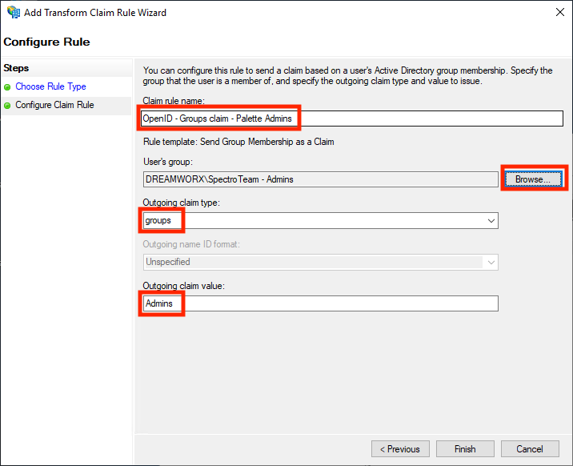

Click **Finish** to add the rule. Click **OK** to save the changes to the Web API rule and click **OK** again to save the changes to the Application Group. Finally, note your AD FS identifier, we will need this for Palette in the next step. Typically this is your AD FS name plus `/adfs`. You can also take the Federation Service identifier and remove `/services/trust` from that URL:

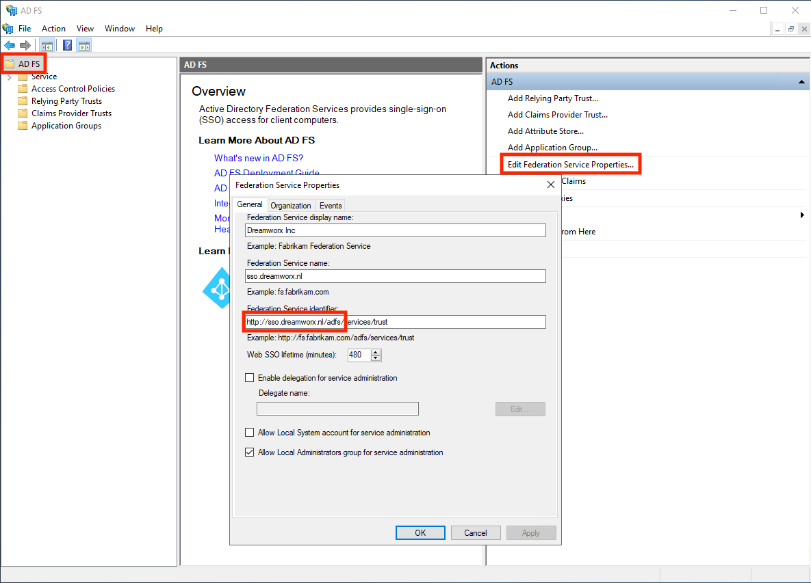

## 2 - Enable OIDC SSO in Palette

Open a web browser and navigate to your Palette subscription. Navigate to **Tenant Settings** --> **SSO** and click **OIDC**. Enter the following information:
* Issuer URL: Your AD FS issuer URL, typically this is your AD FS name plus `/adfs`
* Client ID: the Client Identifier that we noted down in the beginning of the previous step
* Client Secret: the Shared Secret that we generated in the previous step
* Default Teams: leave empty if you don't want users without any groups claims to be assigned to a default group. If you do, enter the desired default group name here. If you use this option, be careful with how much access you give to that group.
* Scopes: set this to `openid` and `allatclaims`
* Email: leave at the default of `email`
* First Name: leave at the default of `given_name`
* Last Name: leave at the default of `family_name`
* Spectro Team: leave at the default of `groups`

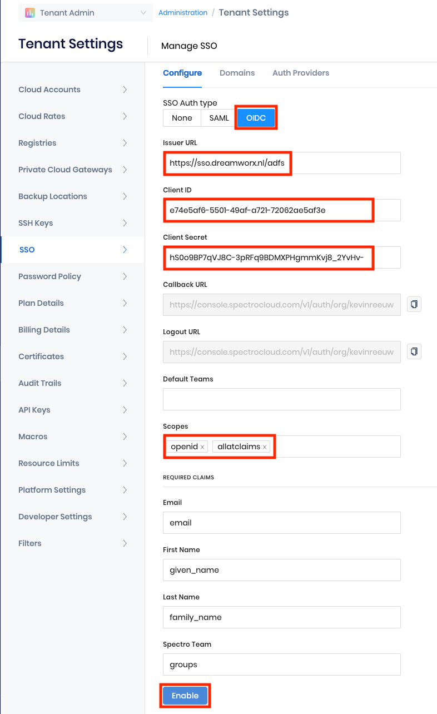

When all the information has been entered, click the **Enable** button at the button to enable SSO. You should receive an `OIDC configured successfully` message.

## 3 - Create Teams in Palette

All that's left to do now is to create Team(s) in Palette for the groups claim(s) that were configured in AD FS, and give them the appropriate permissions. For this example, we will create the `Admins` team and give it `Tenant Admin` permissions. You can repeat this for any other team that you've configured group claims for.

Open a web browser and navigate to your Palette subscription. Navigate to **Tenant Settings** --> **Users & Teams** --> **Teams** tab. Click the **+ Create Team** button.

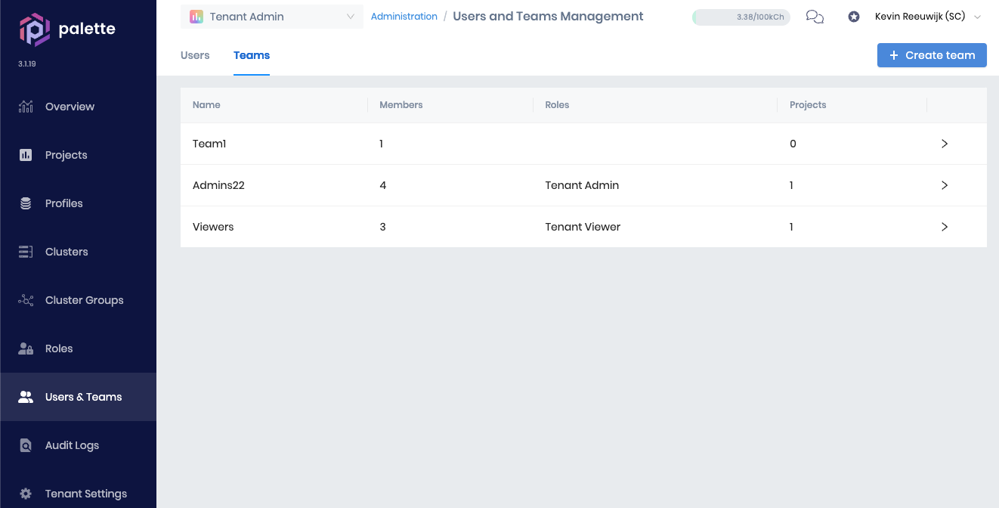

Specify `Admins` in the **Team name** field. We don't need to set any members now, as this will happen automatically from the SSO. Click **Confirm** to create the team.

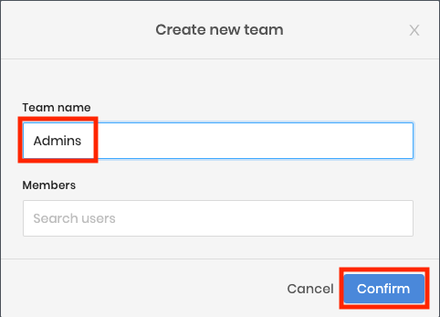

You'll be returned back to the list of Teams. Click on the newly created `Admins` Team to open its details screen. To give this team administrative access to the entire tenant (and thus all Projects in it), we will give this Team the `Tenant Admin` role. Click on **Tenant Roles** --> **+ Add Tenant Role**:

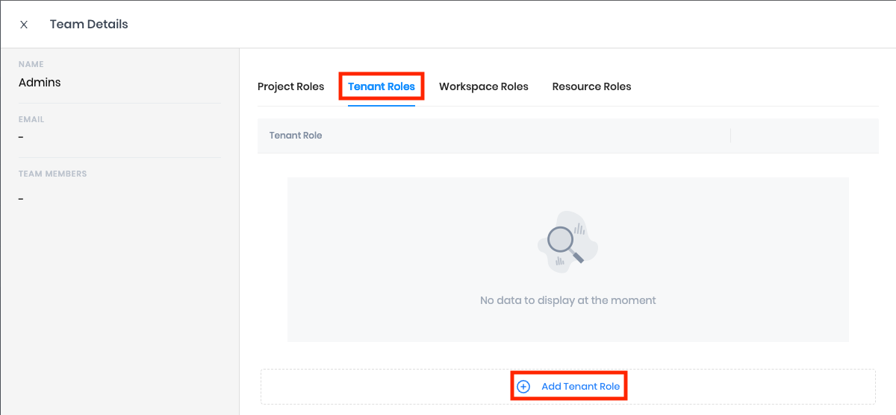

Click on **Tenant Admin** to enable the role, this automatically enables all other roles with fewer permissions. Click **Confirm** to add the role:

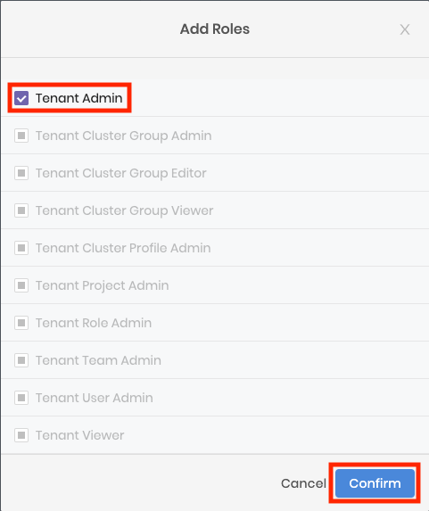

You will see the `Roles have been updated` message to confirm the change. Repeat this procedure for any other teams you need, ensuring they're given the appropriate permissions. Finally click the `X` next to **Team Details** in the top left corner to exit this screen.

Congratulations! You have now successfully configured Palette SSO based on OIDC with Microsoft AD FS!

# Validation
Let's log in through SSO as a user that is a member of the `SpectroTeam - Admins` group in Active Directory to verify that we're automatically getting added to the `Admins` group in Palette.

If you're still logged into Palette with a non-SSO user, log out first by clicking on your name at the top right and selecting `Logout from <tenant name>`:

Notice that the Palette login screen now only shows a big **Sign in** button and no longer a username/password field. Below this button there is an **SSO issues? --> Use your password** link. This can be used to bypass SSO and login with a local Palette account in case there's ever a problem with SSO and you need to access Palette without SSO.

Click the **Sign in** button to login via SSO:

If this is the first time, you will be redirected to the Microsoft AD FS login page. Depending on your company's SSO settings, this could be a simple login form or also require MFA (Multi-Factor Authentication). Make sure you log in as a user that is a member of the `SpectroTeam - Admins` group in Active Directory. Once authenticated, you will automatically be redirected back to Palette and logged into Palette as that user.

You should now be automatically added to the `Admins` team in Palette. To verify, navigate to **Tenant Settings** --> **Users & Teams** --> **Teams** tab. Click the **Admins** team and view the `TEAM MEMBERS` section:

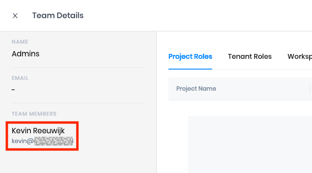

Notice that the user we just logged in with has automatically been added to this team.